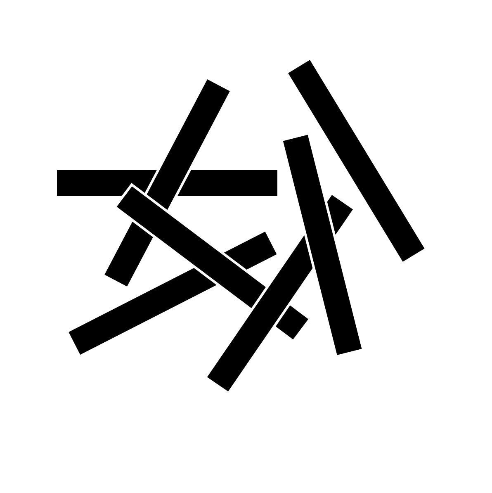

#  Kaleidoscope (re-frame)

This is a re-frame based implementation of the Kaleidoscope Tool for exploratory Analysis of RDF-Data. For more Information you can look at the poster we submitted at UIST 2018:

Mackeprang, Maximilian, et al. "Kaleidoscope: An RDF-based Exploratory Data Analysis Tool for Ideation Outcomes." The 31st Annual ACM Symposium on User Interface Software and Technology Adjunct Proceedings. ACM, 2018.



## Running Kaleidoscope

You will need Leiningen (at least Version XX).
Furthermore, you will need a runnning Fuseki backend, to provide the data.

To run the Application, change into the parent directory and run

```
    lein fig:build.
```


## TODOs
### Style
 * use same colors
 * include dummy-data

### Frontend Functionality
* init-function (inits: cells, available markers)
* ordered available markers
* marker visible/invisible

#### idea-detail view
* annotations (like, rate, tag)
* Text-Annotation
* Created-By


#### CSS Fixes:
* available markers: searhc marker form
* available markers +
* selected markers icon
* selected Markers Toolbar
* cell hover
* cells
* shrink annotations until they fit?


#### Low-Prio
* snapshots
* tabs
* Similar Ideas
* T-Sne + Grid-Mapping Algorithm
* search marker

Indexed Entity pattern
https://purelyfunctional.tv/guide/database-structure-in-re-frame/

TODO: markers and ideas:

```
    (rf/reg-sub
      :cart-items
      (fn [db]
        (mapv (fn [id]
                {:quantity (get-in db [:cart :quantities id])
                 :item (get-in db [:products id])})
          (get-in db [:cart :order]))))


    {:products {123 {:id 123
                     :name "Bag of holding"
                     :price 40
                     :description "..."}
               ...}
     :cart [{:quantity 2 :item 123} ...]
    
    (rf/reg-event-db
      :update-product
      (fn [db [_ product-info]]
        (assoc-in db [:products (:id product-info)] product-info)))
    
    (rf/reg-sub
      :product-info
      (fn [db [_ product-id]]
        (get-in db [:products product-id])))
```
   
    
### Backend Functionality
* SPARQL Limit ist not respected


#### Endpoints
The endpoints are a wrapper around sparql queries to a sparql endpoint running at
"http://localhost:3030/ac2/sparql".


##### http://localhost:9500/api/all-ideas/
Returns a ResultSet with the following data:

```
    "results": {
    "bindings": [
      {
        "idea": { "type": "uri" , "value": "http://purl.org/innovonto/ideas/fce9ab17-6ef2-42db-8745-368eeaee99c1" } ,
        "content": { "type": "literal" , "value": "This would be useful for locating and tracking animals on land whom are endangered." }
      } ,
      {
        "idea": { "type": "uri" , "value": "http://purl.org/innovonto/ideas/e3eeb662-c7f7-4631-a979-cfc971012295" } ,
        "content": { "type": "literal" , "value": "tech powered doggy door. Opens the door when it recognizes your pet" }
      }]}
```

##### http://localhost:9500/api/ideas-by-keyword/{keyword}

The backend uses https://github.com/joelkuiper/yesparql to build the sparql queries.

Evtl alternativ:
https://github.com/AlBaker/clj-sparql

## Development

To get an interactive development environment run:

    lein fig:build

This will auto compile and send all changes to the browser without the
need to reload. After the compilation process is complete, you will
get a Browser Connected REPL. An easy way to try it is:

    (js/alert "Am I connected?")

and you should see an alert in the browser window.

To clean all compiled files:

	lein clean

To create a production build run:

	lein clean
	lein fig:min

## Backend Only

    lein repl
    (use 'ring.adapter.jetty)
    (use 'hcc.innovonto.kaleidoscope.server)
    (run-jetty handler {:port 3000})

## Testing
TODO: Include Circle CI via lein doo:

lein doo phantom test once && lein cljsbuild once advanced ;; esac:
[lein-doo "0.1.7"]]
http://progjobs.co/ducktype/clj-rethinkdb/commit/a3c417ebfc0dbbe20d4d34ecc0f2691cd94ad659

https://github.com/circleci/frontend
Running the Tests

There are two main ways for running tests using the plugin lein doo. If you wish to run the tests only once, you can do that with

lein doo chrome dev-test once

https://github.com/circleci/frontend


## License
This project is distributed under the GNU Affero General Public License v3 (AGPL-3.0) (see LICENSE file)

## Acknowledgements

TODO

